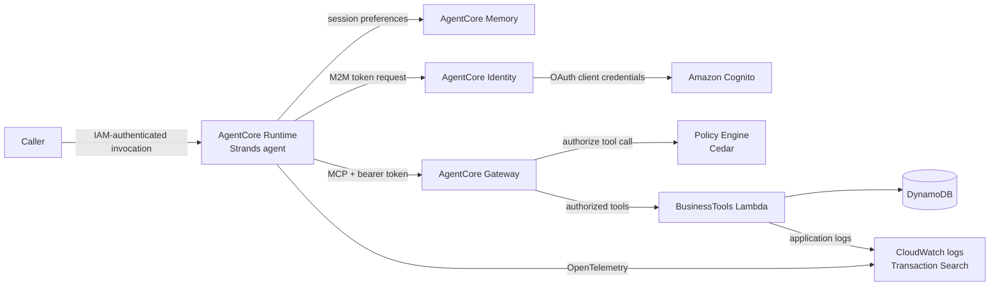

# AgentCore Customer Support POC

Production-like customer-support agent built with:

- AgentCore Runtime + Strands
- AgentCore Gateway + MCP
- AgentCore Memory
- AgentCore Identity and OAuth
- AgentCore Policy Engine + Cedar
- Lambda + DynamoDB
- CloudWatch / OpenTelemetry

## Architecture



[architecture details](docs/architecture.md) describe state ownership,
authorization, reliability, and observability. The Gateway enforces OAuth
scopes at the tool boundary: order and customer lookups require
`support-api/read`; refunds require `support-api/refund` and
`0 < amount <= 1000`. Lambda validates business inputs and uses DynamoDB as
the authoritative store, including conditional writes for refund idempotency.
AgentCore Memory is separate from business data.

## Run end-to-end

The runner provisions or updates the POC in AWS, deploys the application,
invokes the runtime scenarios, verifies responses and data effects, and
refreshes [the evidence document](docs/evidence.md) after a successful run.

Prerequisites:

- `mise`, AWS CLI, `jq`, `curl`, and `zip`
- Active AWS credentials for the intended account, with permissions to manage
  the AWS resources used by this project

From the repository root:

```bash
mise install
aws sts get-caller-identity
./scripts/run_e2e.sh
```

The runner defaults to `eu-west-1`. Override it with `AWS_REGION`. The wait for
cross-session memory extraction defaults to 60 seconds:

```bash
AWS_REGION=eu-west-1 MEMORY_WAIT_SECONDS=120 ./scripts/run_e2e.sh
```

The run creates or updates DynamoDB tables, a Lambda function and IAM roles,
Cognito OAuth resources, and AgentCore Runtime, Gateway, Memory, and policy
resources. It deploys twice: the first deployment resolves generated resource
IDs; the second deploys the completed policy configuration. AWS service usage
and model inference may incur charges. The runner does not tear down resources,
including when a run fails.

Before running, preserve anything valuable in `agentcore/.env.local`: the
runner removes that file while resetting credential configuration. It also
replaces its own prior timestamped Cognito app clients and backs up
`agentcore/agentcore.json` to an ignored, timestamped file. Raw logs, traces,
and scenario outputs go under the git-ignored `artifacts/e2e/`.

## Scenarios

The E2E run exercises and verifies:

- Order `123` lookup, including its delayed status and delivery explanation.
- Customer `CUST-001` lookup and the support-safe profile.
- A USD 500 refund, followed by a retry using the same idempotency key.
- The Cedar refund boundary: USD 1,000 is allowed; USD 1,001 is denied and
  must not create a refund record.
- A prompt-injection request for a USD 5,000 refund, which must be denied.
- Observable failure paths: tool timeout (`ORDER-TIMEOUT`), backend error
  (`ORDER-500`), and bounded repeated polling (`ORDER-LOOP`).
- A user preference written in one runtime session and retrieved in another.

On failure, inspect `artifacts/e2e/failure-diagnostics.txt` and the scenario
files in `artifacts/e2e/`. On success, the evidence document contains the
environment, invocation results, DynamoDB checks, and trace/log evidence from
the latest run.

## Further reading

- [Architecture details](docs/architecture.md)
- [Latest generated E2E evidence](docs/evidence.md)

## Security

No credentials should be committed. Runtime invocation uses IAM; the runtime
obtains outbound OAuth credentials through AgentCore Identity. Refund
authorization is enforced at the Gateway by Cedar, not by the model prompt.
